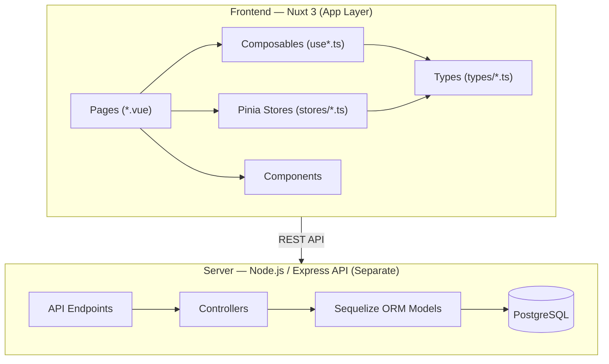
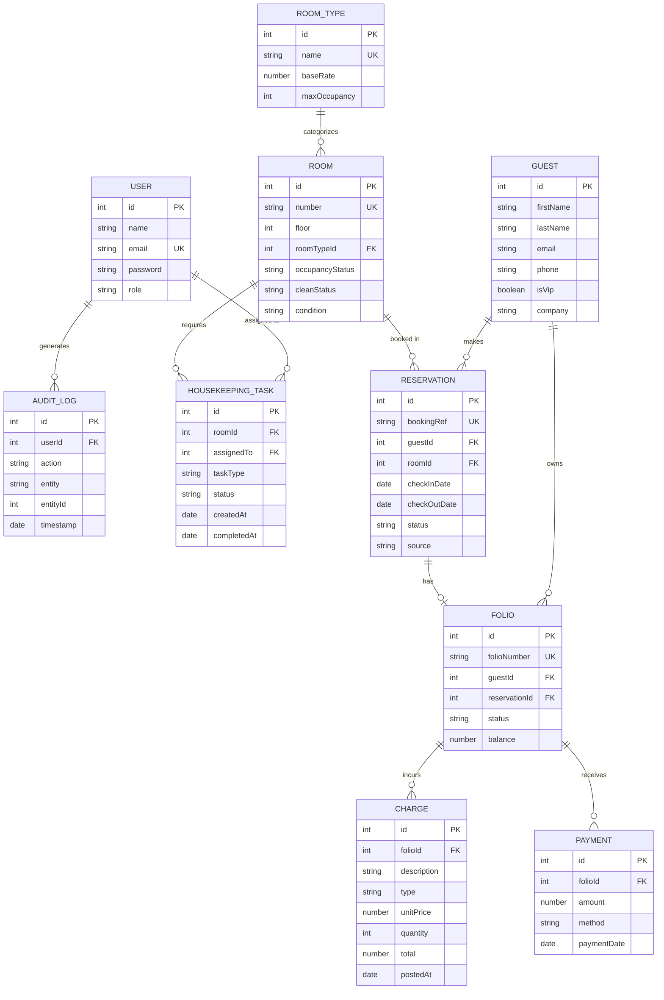
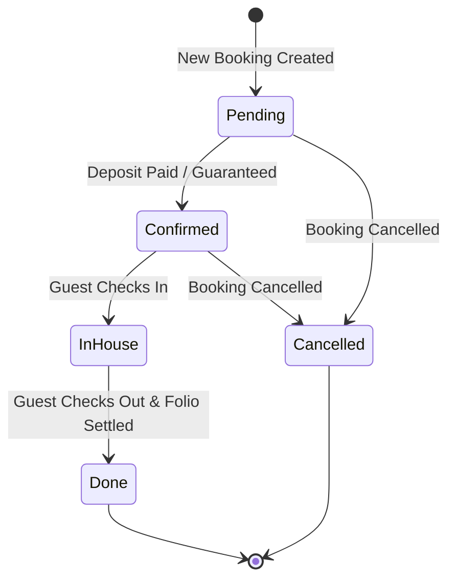
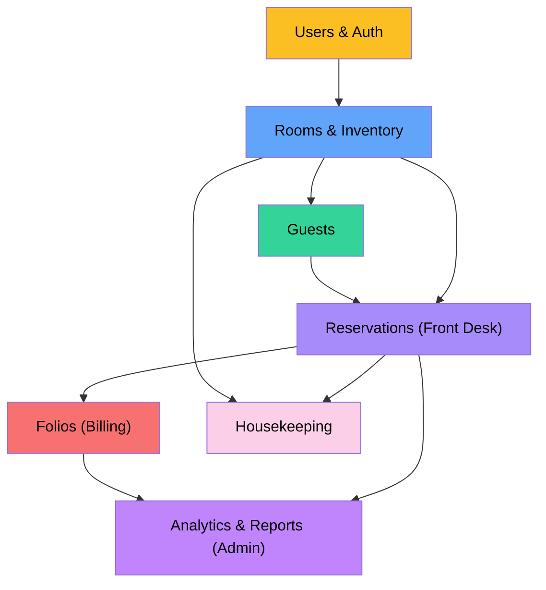

# Presidio Hotel PMS — Architecture, Relationships & Schema

> Single source of truth for data modeling, entity relationships, and schema contracts.
> Use this document as a guideline when building pages, composables, API endpoints, and mock data.

---

## System Architecture Overview



---

## Entity Relationship Diagram



---

## Data Entities — Full Schema Reference

### 1. User

> **Used by**: Authentication, User Management, Housekeeping Tasks, Audit Logs.

| Field | Type | Required | Description |
|-------|------|----------|-------------|
| `id` | `number` | ✅ | Primary key |
| `name` | `string` | ✅ | Full name |
| `email` | `string` | ✅ | Unique email |
| `password` | `string` | ✅ | Hashed password |
| `role` | `'Administrator' \| 'Front Desk' \| 'Billing' \| 'Housekeeping'` | ✅ | System role (RBAC) |
| `isActive` | `boolean` | ✅ | Active status |

---

### 2. Guest

> **Used by**: Guest Profiles, Reservations, Folios.

| Field | Type | Required | Description |
|-------|------|----------|-------------|
| `id` | `number` | ✅ | Primary key |
| `firstName` | `string` | ✅ | First name |
| `lastName` | `string` | ✅ | Last name |
| `email` | `string` | — | Guest email |
| `phone` | `string` | — | Contact number |
| `isVip` | `boolean` | ✅ | VIP status flag |
| `company` | `string \| null` | — | Associated company name |

---

### 3. Room

> **Used by**: Room Management, Front Desk Dashboard, Housekeeping.

| Field | Type | Required | Description |
|-------|------|----------|-------------|
| `id` | `number` | ✅ | Primary key |
| `number` | `string` | ✅ | Room number (e.g., 101, 204) |
| `floor` | `number` | ✅ | Floor level |
| `roomTypeId` | `number` | ✅ | FK → RoomType |
| `rateOverride` | `number \| null` | — | Specific rate overriding base rate |
| `occupancyStatus` | `'Vacant' \| 'Occupied'` | ✅ | Current occupancy |
| `cleanStatus` | `'Clean' \| 'Dirty' \| 'Pickup' \| 'Inspected'` | ✅ | Housekeeping status |
| `condition` | `'Normal' \| 'Maintenance'` | ✅ | Physical condition |

---

### 4. Reservation

> **Used by**: Front Desk (Create Booking, Check-in/out), Admin Dashboard.

| Field | Type | Required | Description |
|-------|------|----------|-------------|
| `id` | `number` | ✅ | Primary key |
| `bookingRef` | `string` | ✅ | Unique reference (e.g., PRS-10001) |
| `guestId` | `number` | ✅ | FK → Guest |
| `roomId` | `number \| null` | — | FK → Room (assigned room) |
| `checkInDate` | `string` (ISO) | ✅ | Expected check-in |
| `checkOutDate` | `string` (ISO) | ✅ | Expected check-out |
| `status` | `'Pending' \| 'Confirmed' \| 'In-House' \| 'Done' \| 'Cancelled'` | ✅ | Booking lifecycle state |
| `source` | `'Walk-in' \| 'Phone' \| 'OTA' \| 'Corporate'` | ✅ | Origin of booking |

---

### 5. Folio

> **Used by**: Billing Module, Checkout Process.

| Field | Type | Required | Description |
|-------|------|----------|-------------|
| `id` | `number` | ✅ | Primary key |
| `folioNumber` | `string` | ✅ | Unique folio ID |
| `guestId` | `number` | ✅ | FK → Guest |
| `reservationId` | `number` | ✅ | FK → Reservation |
| `status` | `'Open' \| 'Closed' \| 'Settled'` | ✅ | Folio state |
| `balance` | `number` | ✅ | Current outstanding balance |
| `openedAt` | `string` (ISO) | ✅ | When folio was created |

---

### 6. Charge

> **Used by**: Billing Module (Folio Details).

| Field | Type | Required | Description |
|-------|------|----------|-------------|
| `id` | `number` | ✅ | Primary key |
| `folioId` | `number` | ✅ | FK → Folio |
| `description` | `string` | ✅ | Item/service name |
| `type` | `'Room Charge' \| 'Mini Bar' \| 'Restaurant' \| 'Laundry' \| 'Misc'` | ✅ | Charge category |
| `unitPrice` | `number` | ✅ | Cost per item |
| `quantity` | `number` | ✅ | Number of items |
| `total` | `number` | ✅ | Computed: unitPrice * quantity |
| `postedAt` | `string` (ISO) | ✅ | Time posted |

---

### 7. Payment

> **Used by**: Billing Module (Folio Details).

| Field | Type | Required | Description |
|-------|------|----------|-------------|
| `id` | `number` | ✅ | Primary key |
| `folioId` | `number` | ✅ | FK → Folio |
| `amount` | `number` | ✅ | Payment amount |
| `method` | `'Cash' \| 'Credit Card' \| 'Bank Transfer'` | ✅ | Payment method |
| `paymentDate`| `string` (ISO) | ✅ | Time payment was made |

---

### 8. HousekeepingTask

> **Used by**: Housekeeping Module.

| Field | Type | Required | Description |
|-------|------|----------|-------------|
| `id` | `number` | ✅ | Primary key |
| `roomId` | `number` | ✅ | FK → Room |
| `assignedTo` | `number \| null` | — | FK → User (Housekeeper) |
| `taskType` | `'Cleaning' \| 'Turn-down' \| 'Maintenance'` | ✅ | Type of task |
| `status` | `'Pending' \| 'In Progress' \| 'Completed'` | ✅ | Task status |
| `createdAt` | `string` (ISO) | ✅ | Task creation |
| `completedAt`| `string \| null` | — | Task completion |

---

## Entity → Page Mapping

| Page | Primary Entity | Related Entities | Store/Composable |
|------|---------------|------------------|------------------|
| Admin Dashboard | Dashboard Stats | Reservation, Room, Folio | `useAdminDashboard()` |
| Guest Management| `Guest` | `Reservation`, `Folio` | `useGuestsStore()` |
| Room Management | `Room` | `RoomType` | `useRoomsStore()` |
| Front Desk Dash | `Reservation` | `Room`, `Guest`, `Folio` | `useFrontDesk()` |
| Search/Booking | `Reservation` | `Room`, `Guest` | `useReservationsStore()` |
| Open Folios | `Folio` | `Charge`, `Payment`, `Guest`| `useFoliosStore()` |
| Housekeeping | `Room` | `HousekeepingTask` | `useHousekeepingStore()` |
| Simulation | `SimulationConfig`| All | `useSimulation()` |

---

## Data Flow — Guest & Reservation Lifecycle



---

## Relationship Summary

```
Guest ──┬── makes ──→ Reservation ──┬── assigned to ──→ Room ──→ categorizes ──→ RoomType
        │                           │                    │
        └── owns ───→ Folio         │                    └── requires ──→ HousekeepingTask
                        ├── incurs ──→ Charge
                        └── receives ─→ Payment
```

---

## Mock Data File Mapping

During frontend-first development, data will reside in mock files or Pinia stores.

| Entity | Mock Data Location | Store |
|--------|--------------------|-------|
| User | `app/data/mock/users.ts` | `auth.ts` |
| Guest | `app/data/mock/guests.ts` | `guests.ts` |
| Room & RoomType | `app/data/mock/rooms.ts` | `rooms.ts` |
| Reservation | `app/data/mock/reservations.ts`| `reservations.ts`|
| Folio & Charges | `app/data/mock/folios.ts` | `folios.ts` |

---

## TypeScript Type File Strategy

Types will be structured in `app/types/index.ts` (or split logically):

| Type | Contains |
|------|----------|
| `User` | User profile and roles |
| `Guest` | Guest details, VIP status |
| `Room` | Room properties, statuses |
| `Reservation`| Booking details, lifecycle states |
| `Folio` | Billing entities (Folio, Charge, Payment) |
| `Simulation` | Event weights, simulation config |

---

## Role-Based Access Control (RBAC) Matrix

| Feature | Administrator | Front Desk | Billing Officer | Housekeeping |
|---------|---------------|------------|-----------------|--------------|
| **Admin Dashboard** | ✅ Full | ❌ | ❌ | ❌ |
| **Manage Users** | ✅ Full | ❌ | ❌ | ❌ |
| **Manage Rooms** | ✅ Full | View Only | ❌ | View Only |
| **Reports** | ✅ Full | ❌ | ❌ | ❌ |
| **Simulation Engine**| ✅ Full | ❌ | ❌ | ❌ |
| **Front Desk Dash** | View | ✅ Full | ❌ | ❌ |
| **Reservations** | View | ✅ CRUD | View | ❌ |
| **Check-in/out** | ❌ | ✅ Full | ❌ | ❌ |
| **Guests** | ✅ Full | ✅ Full | View | ❌ |
| **Billing Dash** | View | View | ✅ Full | ❌ |
| **Folios/Payments** | View | View | ✅ Full | ❌ |
| **Housekeeping Dash**| View | View | ❌ | ✅ Full |
| **Room Status Update**| View | View | ❌ | ✅ Full |

---

## Build Dependency Chain


